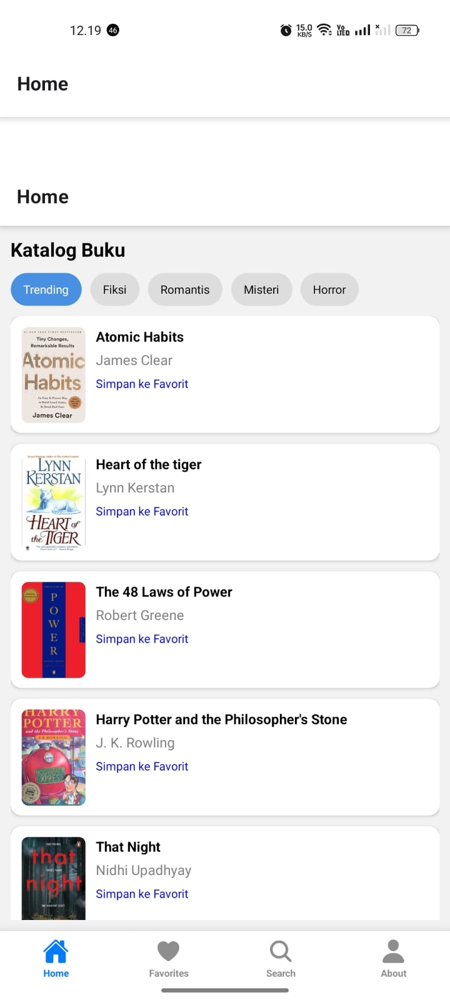
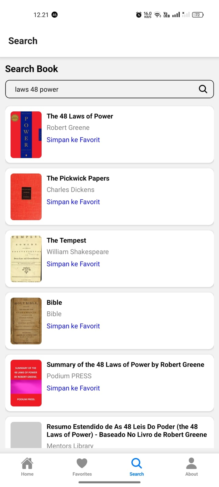
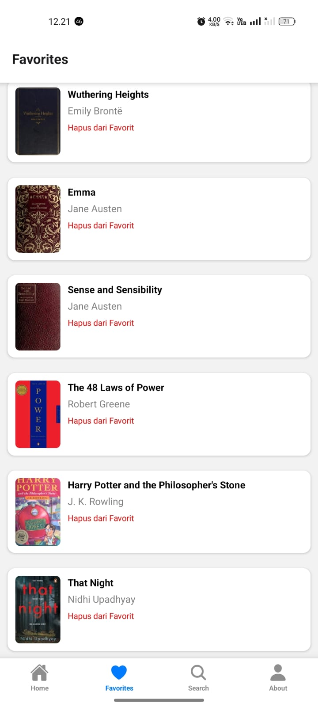
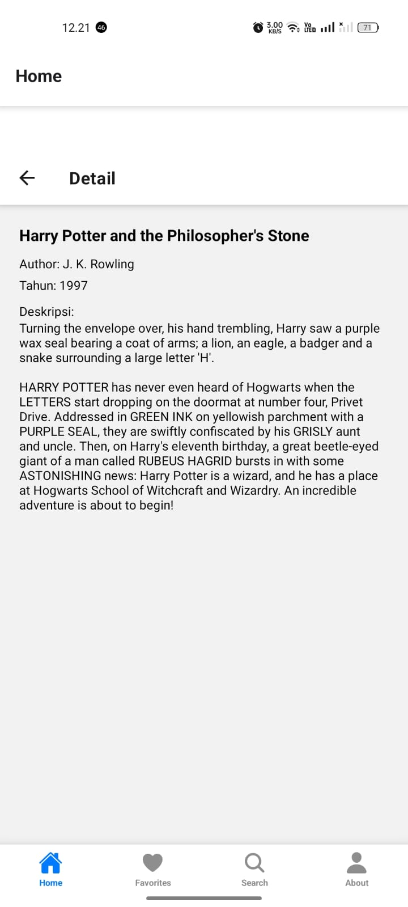
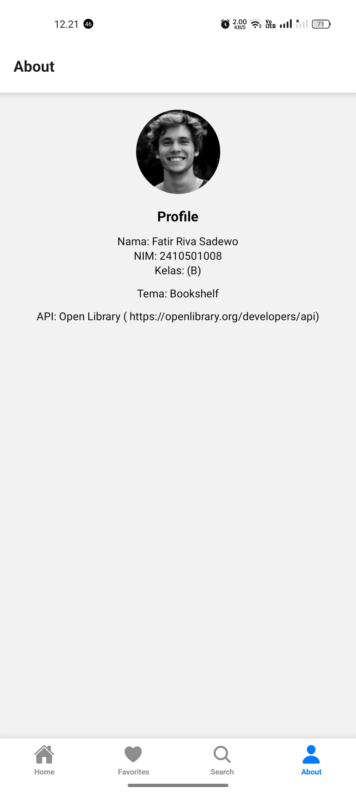

## 1. Book App
Nama    : Fatir Riva Sadewo  
NIM     : 2410501008  
Kelas   : B

## 2. Tema
Tema C: BookShelf - Katalog Buku

## 3. Tech Stack
Aplikasi ini dibangun menggunakan teknologi berikut:
- **React Native (Expo)** — framework untuk membangun aplikasi mobile
- **JavaScript** — bahasa pemrograman utama yang digunakan
- **React Navigation** — untuk navigasi antar screen (Stack & Bottom Tabs)
- **Fetch API** — untuk mengambil data dari API eksternal
- **Context API** — untuk state management (fitur favorit)
- **OpenLibrary API** — sebagai sumber data buku
### Dependencies utama:
- @react-navigation/native
- @react-navigation/native-stack
- @react-navigation/bottom-tabs
- react-native-screens
- react-native-safe-area-context
- react-native-gesture-handler
- react-native-reanimated
- @expo/vector-icons
### Versi:
- Expo: 54.0.33
- React Native: 0.81.5

## 4. Cara Install & Run
git clone https://github.com/ftirrivasdwo175-ops/uts-mobile-lanjut-2410501008-FatirRivaSadewo
cd uts-MobileLanjut
npm install
npx expo start

## 5. Screenshot

Home Screen :  

Search Screen :  

Favorites Screen :  

Detail Screen :  

About Screen :  

## 6. Video Demo 
Google Drive: https://drive.google.com/drive/folders/16B9QZ4q_kT45hQ5uuAwg1AYhyUsvEAiX?usp=drive_link

## 7. State Management
State management yang digunakan dalam aplikasi ini adalah Context API.

Context API digunakan untuk menyimpan data buku favorit agar dapat diakses oleh beberapa screen seperti Home, Search, dan Favorites tanpa perlu mengirim data melalui props secara berulang (props drilling).

Pemilihan Context API dilakukan karena:
- Lebih sederhana dibandingkan Redux atau Zustand
- Cocok untuk aplikasi dengan skala kecil hingga menengah
- Mudah diimplementasikan dan dipahami
Dengan menggunakan Context API, pengelolaan state menjadi lebih terpusat dan efisien.

## 8. Referensi
- https://reactnavigation.org/
- https://docs.expo.dev/
- https://openlibrary.org/
- https://stackoverflow.com/

## 9. Refleksi
Selama proses pengembangan aplikasi ini, saya menghadapi beberapa tantangan, terutama dalam mempelajari struktur data dari Open Library API. Setiap endpoint, seperti trending, subject, dan search, memiliki format data yang berbeda-beda, yang menyebabkan kebingungan dalam pemrosesan data.

Berbagai bug yang saya alami antara lain adalah pengarang yang tidak muncul dan hanya tertulis "Unknown Author", serta gambar sampul buku yang tidak terlihat pada fitur trending. Hal ini terjadi karena adanya perbedaan pada bidang seperti authors, author_name, cover_id, dan cover_i di setiap endpoint. Selain itu, saya juga mengalami masalah dengan fitur pull-to-refresh dan penanganan error yang awalnya tidak berfungsi dengan baik ketika koneksi internet terputus.

Saya juga menemukan masalah pada fitur pencarian yang tidak dapat kembali dikosongkan, serta potensi terjadinya duplikasi data favorit jika tidak ada pengecekan yang dilakukan sebelumnya.

Dari pengerjaan aplikasi ini, saya belajar cara mengelola state menggunakan Context API, menyadari pentingnya penyesuaian data dari API yang berbeda, serta cara melakukan debugging untuk mengatasi bug yang muncul. Selain itu, saya juga memahami cara menjaga konsistensi tampilan UI agar aplikasi terlihat lebih teratur dan nyaman untuk digunakan.